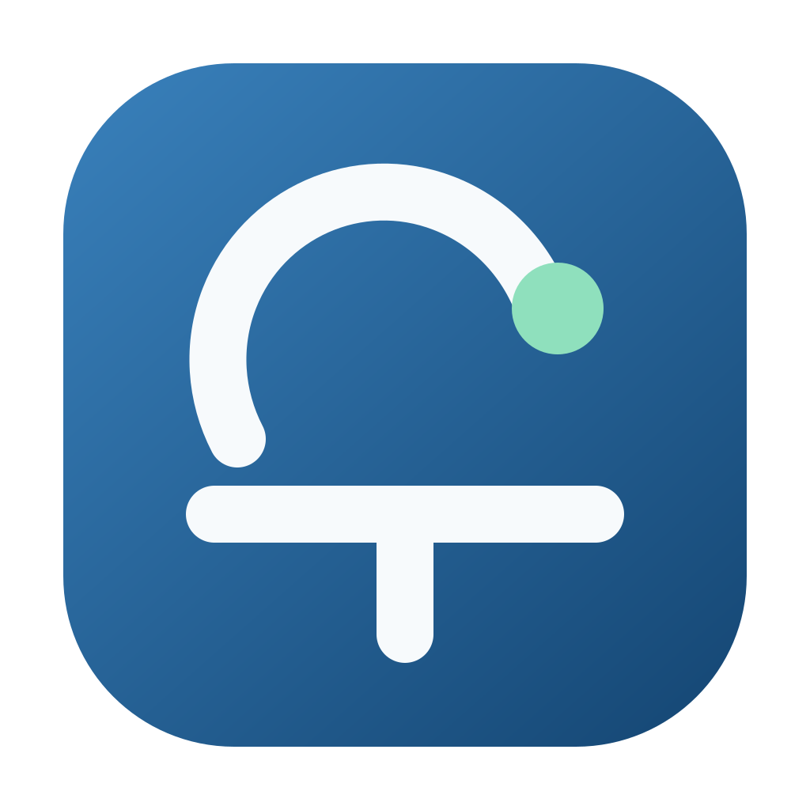

# CodexRelay

<p align="center">
  
</p>

<p align="center">
  <a href="https://github.com/cwwcn/CodexRelay/actions/workflows/ci.yml"></a>
  <a href="https://github.com/cwwcn/CodexRelay/releases/latest"></a>
  <a href="LICENSE"></a>
</p>

**Use Codex on your own Mac from Telegram.**

CodexRelay is a macOS menu bar app that connects Telegram with a local Codex runtime. Your Mac executes work in the selected conversation's working directory, while Telegram provides remote conversation, approvals, and status updates. Conversations, optional project associations, context, model settings, and approval state stay on your Mac.

English | [简体中文](README.zh-CN.md) | [Documentation](docs/)

> **Current release:** `v0.1.2`
>
> This release targets Apple Silicon and Intel Macs. The distributed app is ad-hoc signed and is not yet Apple-notarized; the first-launch instructions below explain the one-time macOS security confirmation.

## Why CodexRelay

Send a task to your Telegram bot and let your own Mac run Codex in the selected conversation's working directory. A conversation may be associated with an explicitly approved project, or remain unassigned. Results and progress are sent back to Telegram. CodexRelay is not a hosted code execution service: the task runs locally on your Mac.

## Features

- Telegram text and image input;
- One-time pairing code and single-user authorization;
- Project directories are explicitly approved in the Mac app and may optionally be associated with a conversation;
- An independent Codex thread for each conversation, including conversations without a project;
- Per-conversation Codex model and reasoning-effort settings;
- One active task globally; switching conversations is blocked while a task is running;
- Durable persistence for Codex threads/turns, Telegram inbox/outbox, and task state;
- One-time Telegram approval for dangerous commands, file changes, and extra permissions;
- Optional per-project “auto-allow within this project” approval mode, protected by explicit confirmation; unassigned conversations remain fully usable and use controlled safe mode for risky operations;
- Menu bar overview panel, settings window, task stop action, and quit confirmation;
- Telegram Bot Token stored in CodexRelay's private app-data file with user-only permissions;
- Optional sleep prevention while a task is running;
- Rotating logs, single-instance protection, and crash-recovery safeguards.

## Security boundaries

- The Bot Token is never written to TOML, SQLite, environment variables, command-line arguments, or logs;
- Telegram access is unavailable until pairing is complete;
- Telegram cannot add arbitrary local directories;
- **Scan Projects** synchronizes the active list with the current scan result: projects inside the configured scan roots that are no longer found (including moved or renamed projects) are hidden, while projects manually registered outside those roots are left untouched. Database records remain recoverable, and no project files are deleted;
- Approval buttons are single-use, and both allow and deny decisions are reported explicitly;
- The default approval mode is **Safe mode**. The optional project auto-allow mode is limited to the current project path, bound to the current paired Telegram identity, and resets after project switching or re-pairing. It never grants access outside the project or bypasses macOS privacy permissions;
- CodexRelay never modifies your global `~/.codex/config.toml`;
- GitHub Releases update checking is available; when automatic checks find a release, the menu-bar panel shows a “New version available” action. After the user clicks it, CodexRelay selects the current Mac architecture's DMG, verifies its SHA-256 digest, and opens the installer for manual replacement.

## Requirements

For the packaged DMG:

- macOS on Apple Silicon or Intel;
- Codex CLI installed and authenticated on the Mac;
- A Telegram Bot Token.

CodexRelay currently supports one-to-one Telegram chats only; group chats and channels are not supported. Create the bot through [@BotFather](https://t.me/BotFather), and keep the Bot Token private.

For source development, Python 3.12 and `uv` are also required.

## Install from GitHub Releases

Download the DMG matching your Mac from [GitHub Releases](https://github.com/cwwcn/CodexRelay/releases): `arm64` for Apple Silicon (M-series) or `x86_64` for Intel. Open it and drag CodexRelay to Applications.

### First launch on macOS

The current distribution is not Apple-notarized, so macOS may block the first launch:

1. Double-click CodexRelay and dismiss the security alert;
2. Open **System Settings → Privacy & Security**;
3. Scroll to the security message for CodexRelay;
4. Click **Open Anyway**, then confirm;
5. Launch CodexRelay again.

You can also right-click the app in Finder and choose **Open**. Do not disable Gatekeeper globally. If macOS says the app will damage your computer or moves it to the Trash, do not bypass the warning; download the package again and report the message.

### Where the app appears

CodexRelay is a menu bar app. It normally does not open a Dock window when launched. Click the CodexRelay icon in the macOS menu bar to open the overview panel, then choose **Settings** to complete setup. If the menu bar is crowded, look in the macOS Control Center or remove unused menu bar items temporarily.

## Quick start

### 1. Run from source

```bash
uv sync --extra dev --extra gui
uv run codexrelay init
uv run codexrelay-gui
```

### 2. Complete first-time setup

1. Install and authenticate Codex CLI on the Mac;
2. Create a bot with [@BotFather](https://t.me/BotFather) and copy its Bot Token;
3. Enter the token on CodexRelay's **Telegram** page;
4. Optionally add and approve project directories from the **System** page's project section. A conversation may remain unassigned;
5. Generate a one-time pairing code;
6. Message your bot in a private Telegram chat with `/pair 123456`.

The token is stored only in CodexRelay's private app-data file, never in a project configuration file.

When a project is added, CodexRelay performs a minimal access preflight immediately. If the project is inside a protected folder such as Documents, macOS may ask for permission at this setup stage; complete it before running Telegram tasks.

> Upgrading from an older development build: to avoid recurring macOS Keychain authorization prompts, current builds no longer read the legacy Keychain entry. Enter the Bot Token once again on the Telegram page after upgrading.

## Telegram commands

For daily use, remember these commands:

```text
/sessions       List all conversations
/session 1      Select a conversation
```

After selecting a conversation, send ordinary text to run a task. A conversation may have a project association or remain unassigned. Use `/new` when you need a fresh context; use `/stop` when you need to stop a running task.

Full command reference:

```text
/help
/pair 123456
 Pair a Telegram account for first-time setup
/projects
 List project associations (compatibility command)
/use 1
/use CodexRelay
 Select a project context (compatibility command; prefer `/session`)
/new
 Create a new conversation in the current conversation's working directory
/sessions
 List all discovered Codex conversations, including unassigned sessions
/session <number>
 Switch the current conversation
/models
/model 2
/reasoning high
/status
/security
/stop
 Stop the current task
/release
 Clear an abnormal stale state (usually unnecessary)
/takeover
 Show hand-off information (compatibility command; no manual takeover)
```

`/help` groups commands into conversation actions, task control, configuration and security, and first-time setup. Project management commands remain accepted as compatibility commands, but project management belongs in the Mac app's **System** page and selecting a conversation should use `/sessions` and `/session`. Before pairing, only `/pair <six-digit code>` is accepted (the BotFather deep-link form `/start pair_<six-digit code>` is also supported); a paired account that sends `/pair` again receives a status message instead of accidentally submitting a Codex task. `/security` shows the current conversation's approval mode; project conversations may opt into “auto-allow within this project” after a second confirmation, while unassigned conversations remain usable and use controlled safe mode for risky operations. `/reasoning` changes the reasoning effort; `/effort` is accepted as a compatibility alias. Settings are stored in CodexRelay's local database and do not modify `~/.codex/config.toml`.

Project switching is allowed only after the current task finishes. `/use` remains a compatibility command for older workflows; the primary flow is to choose a conversation with `/sessions` and `/session`. Switching a project association does not delete conversation history.

Conversations are the primary object and may optionally belong to a project. Use `/sessions` to list every discovered Codex conversation grouped by project and unassigned status, `/session <number>` to select one, and `/new` to create one in the current working directory. The Mac app provides the same global Sessions page. Startup, periodic background sync, and each session-list request reconcile the list. When a conversation is deleted or archived in Codex, the next successful sync hides it from active views while retaining local history; if the current conversation disappears, the first still-valid conversation is selected automatically. Unassigned conversations can be selected and executed directly, but use controlled safe mode and request approval for risky operations. Telegram releases its short-lived task occupancy automatically when a task finishes, so returning to the computer requires no manual hand-off. Conversation context is isolated, and model/reasoning settings follow each conversation. `/use` remains a project-selection compatibility command; `/release` clears an abnormal stale state; `/takeover` is retained for compatibility. Unknown slash commands are rejected explicitly instead of being sent as Codex tasks.

## Models and reasoning effort

Choose the model and reasoning effort on the Mac app's **Codex** page or from Telegram:

```text
/models
/model 2
/reasoning high
```

Settings are stored in CodexRelay's own SQLite database and apply only to the selected conversation. They do not change the global defaults used by Codex CLI, the Codex desktop app, or other conversations.

## Local data

| Data | Default location |
| --- | --- |
| Database and settings | `~/Library/Application Support/CodexRelay/` |
| Runtime logs | `~/Library/Logs/CodexRelay/` |
| Telegram Bot Token | CodexRelay private app-data file (`0600`) |

Logs rotate at 2 MB and keep three historical files (about 8 MB maximum). The database stores projects, sessions, tasks, messages, approvals, and delivery state; it does not store the Bot Token.

## Development and tests

```bash
uv sync --extra dev --extra gui
uv run ruff check .
uv run mypy --strict src
QT_QPA_PLATFORM=offscreen uv run pytest -q
```

The current quality gate includes Ruff, strict Mypy, and the full Pytest suite; all checks run in GitHub Actions.

## Build the macOS app

```bash
uv sync --extra gui --extra packaging
./scripts/build_app.sh
```

The build script places intermediate files and the app bundle in `artifacts/` and refuses to overwrite an existing `.app`. Personal builds use ad-hoc signing; distribution requires Apple Developer ID signing and notarization.

## Current limitations and roadmap

- One task runs globally at a time;
- Telegram is the first connector; the core layer leaves room for future connectors;
- Apple Silicon and Intel are supported through architecture-specific DMG packages;
- The current update flow downloads and opens the matching GitHub Release DMG after user confirmation; the final drag-to-Applications step remains manual because the package is not yet Apple-notarized;
- Planned work includes signed/notarized distribution, optional Sparkle-based in-place updates, and additional connectors.

## Documentation

- [Technical design](docs/CodexRelay-技术方案.md)
- [macOS product-shape research](docs/macos-product-redesign-research.md)
- [Menu bar design research](docs/menu-bar-design-research.md)
- [Changelog](CHANGELOG.md)

## License

CodexRelay is released under the [MIT License](LICENSE).
